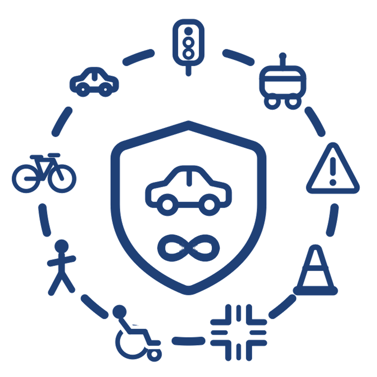
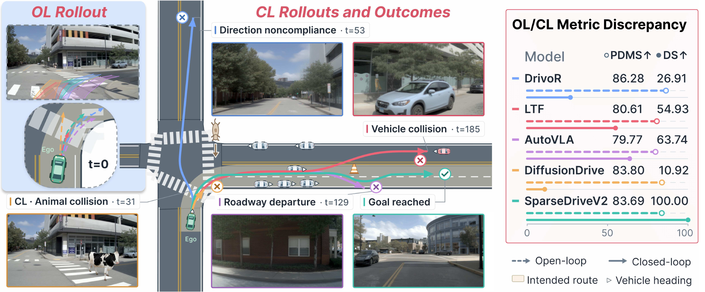
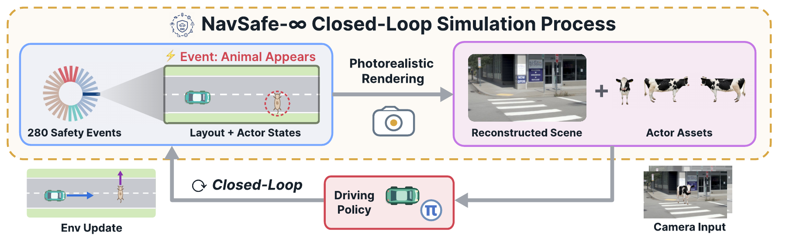

<div align="center">
  
  <h1>NavSafe-∞: Benchmarking Closed-Loop Driving Safety<br>in Photorealistic Environments</h1>
  <p>
    Yuxin Bao<sup>1,*</sup>, Hongwei Ruan<sup>2,*</sup>, Luobin Wang<sup>2,†</sup>, Seth Z. Zhao<sup>1,†</sup>, Ziyang Leng<sup>1</sup>,<br>
    Zihan Zhang<sup>2</sup>, Yu Zeng<sup>3</sup>, Rowan McAllister<sup>3</sup>, Henrik Christensen<sup>2</sup>, Bolei Zhou<sup>1</sup>
  </p>
  <p><sup>1</sup>UCLA &nbsp;·&nbsp; <sup>2</sup>UCSD &nbsp;·&nbsp; <sup>3</sup>Toyota Research Institute<br>
  <sub>* Equal contribution; order by last name &nbsp; † Corresponding authors</sub></p>
  <p>
    <a href="https://navsafe-vail.github.io/"></a>
    <a href="https://arxiv.org/abs/2609.26618"></a>
    <a href="https://huggingface.co/datasets/c13752hz/NavSafe"></a>
  </p>
  <p><a href="#overview">Overview</a> · <a href="#quick-start">Quick Start</a> · <a href="#documentation">Documentation</a> · <a href="https://navsafe-vail.github.io/#leaderboard">Leaderboard</a> · <a href="#citation">Citation</a></p>
</div>

<p align="center">
  
  <br>
  <em>Strong open-loop scores do not guarantee safe closed-loop behavior.</em>
</p>

## Overview

**NavSafe-∞** benchmarks closed-loop driving safety in photorealistic reconstructed environments. The benchmark contains **280 scenarios across 28 safety event types**, with event-specific success and failure criteria. Camera observations reflect the evolving ego and actor states, allowing evaluation of how a policy interacts, recovers, and handles compounding errors.

This repository provides the toolbox for scenario mining, reconstruction preparation, asset harvesting, recipe authoring and replay, policy evaluation, visualization, scoring, and result aggregation.

### What you can do

- **Evaluate driving policies in closed loop** with reconstructed camera observations, configurable camera rigs, and policy adapters.
- **Create and replay safety events** using editable actor assets, traffic behavior, and frozen scenario recipes.
- **Diagnose policy failures** with camera and bird’s-eye visualizations, per-run artifacts, and event-aware scoring.
- **Prepare new environments** through source-clip reconstruction and actor asset harvesting.

<p align="center">
  
  <br>
  <em>Reconstructed scenes and editable actors connect policy planning to simulation feedback.</em>
</p>

### Benchmark at a glance

| Safety category | Capability evaluated |
| :--- | :--- |
| **Traffic Crashes (TC)** | Respond to vehicle conflicts and collision hazards. |
| **Vulnerable Road User Crashes (VRUC)** | Interact safely with pedestrians and other vulnerable road users. |
| **Traffic Violations (TV)** | Follow traffic controls and event-specific rules. |
| **Traffic Incidents (TI)** | Handle work zones, obstructions, and unexpected conflicts. |

Evaluation reports **driving score (DS)**, **success rate (SR)**, **driving efficiency (DE)**, and **comfort**, together with category-level capability scores. See the [leaderboard](https://navsafe-vail.github.io/#leaderboard) for policy comparisons and the [scoring guide](docs/navsafe_termination_and_success.md) for termination and success semantics.

## Quick Start

### 1. Install

Use **Linux x86-64**, **Python 3.12**, [uv](https://docs.astral.sh/uv/), and NVIDIA hardware with a compatible driver. NuRec rendering uses an NVIDIA NRE container through Docker or an existing gRPC service.

```bash
git clone --recurse-submodules https://github.com/VAIL-UCLA/NavSafe-infty.git
cd NavSafe-infty
uv sync --locked --python 3.12
source .venv/bin/activate
```

See the [installation guide](docs/installation.md) for simulator prerequisites, renderer setup, and existing checkouts.

### 2. Download a scenario

The published data is available on [Hugging Face](https://huggingface.co/datasets/c13752hz/NavSafe). Select a scenario token from the dataset’s `full_test/` directory:

```bash
export NAVSAFE_DATA_ROOT="<absolute-dataset-directory>"
export TOKEN="<scenario-token>"
python -m navsafe.benchmark.eval.fetch_bundle \
  --token "$TOKEN" --out "$NAVSAFE_DATA_ROOT"
```

`--token` is required and repeatable; `--out` is the dataset root. The downloader defaults to `c13752hz/NavSafe`; use `--repo` to select another repository with the same bundle layout.

```text
<NAVSAFE_DATA_ROOT>/
├── full_test/<scenario-token>/
│   ├── manifest.json
│   ├── arrow/
│   ├── offsets/
│   ├── ah_assets/
│   └── *.usdz
├── asset/
├── gait_bank/
├── model_zoo/<model-directory>/
└── proxy/                         # Optional authoring subset
```

A scenario download retrieves its bundle. Download shared assets, gait banks, and model weights separately using the [evaluation guide](docs/navsafe_eval.md#download-assets-and-a-model). For reproducible runs, pin the dataset revision as described there. See [data layout](docs/public-data-layout.md) for resource paths.

### 3. Run a policy

Follow the [evaluation guide](docs/navsafe_eval.md) to connect to an existing NuRec gRPC renderer or launch the local Docker wrapper, then run your policy with its matching adapter and checkpoint.

For benchmark entries with edits, use the [edited-scenario guide](docs/navsafe_eval_edited_scene.md) to apply the frozen recipe to its matching bundle. Preserve the recipe and evaluation settings when comparing policies.

```bash
# Inspect evaluator options in the installed environment.
navsafe-eval --help

# Validate a completed episode’s metrics and artifacts.
python scripts/evaluator/validate_eval_output.py "<episode-output-directory>"
```

The [results guide](docs/navsafe_eval.md#results-and-full-sweeps) explains how to inspect `navsafe_metrics.json` and aggregate valid scored episodes.

## Documentation

| Guide | What it covers |
| :--- | :--- |
| [Getting started](docs/navsafe_getting_started.md) | The path from installation to a scored episode. |
| [Installation](docs/installation.md) | Environment, simulator, and renderer prerequisites. |
| [Data layout](docs/public-data-layout.md) | Published bundles, shared assets, and resource paths. |
| [Policy evaluation](docs/navsafe_eval.md) | Downloads, renderer connection, inference, and output validation. |
| [Edited scenarios](docs/navsafe_eval_edited_scene.md) | Frozen recipes and matching scene bundles. |
| [Recipe editor](navsafe/benchmark/editor/README.md) | Authoring and inspecting scenario edits. |
| [Asset harvesting](docs/navsafe_harvested_actors.md) | Building and using actor replacement banks. |
| [Reconstruction](docs/reconstruct_navsim_nuplan.md) | Preparing and reconstructing new source clips. |
| [Scoring and termination](docs/navsafe_termination_and_success.md) | Episode status, termination reasons, and success criteria. |
| [Kubernetes deployment](deploy/nautilus/README.md) | Generating a renderer manifest for your cluster. |

## Policy Integration

Policy adapters live in [`navsafe/policy`](navsafe/policy), and inference components live in [`navsafe/modelzoo`](navsafe/modelzoo). Pass the registered adapter name and matching checkpoint path to the evaluator; model weights are downloaded separately. Some adapters also require a model configuration. See [evaluation options](docs/navsafe_eval.md#existing-renderer) and [GTRS checkpoint settings](docs/gtrs.md).

## Citation

If NavSafe-∞ supports your research, please cite our [paper](https://arxiv.org/abs/2609.26618):

```bibtex
@article{bao2026navsafe,
  title={{NavSafe-$\infty$: Benchmarking Closed-Loop Driving Safety in Photorealistic Environments}},
  author={Bao, Yuxin and Ruan, Hongwei and Wang, Luobin and Zhao, Seth Z. and Leng, Ziyang
          and Zhang, Zihan and Zeng, Yu and McAllister, Rowan and Christensen, Henrik and Zhou, Bolei},
  journal={arXiv preprint arXiv:2609.26618},
  year={2026}
}
```

## License and Acknowledgements

This repository is licensed under [Apache 2.0](LICENSE). Third-party components, model weights, and datasets retain their respective licenses.

We thank the authors and maintainers of [Isaac Sim](https://github.com/isaac-sim/IsaacSim), [Isaac Lab](https://github.com/isaac-sim/IsaacLab), [NVIDIA NuRec](docs/reconstruct_navsim_nuplan.md), [py123d](https://github.com/kesai-labs/py123d), and the integrated driving policies for their tools and open research resources.
